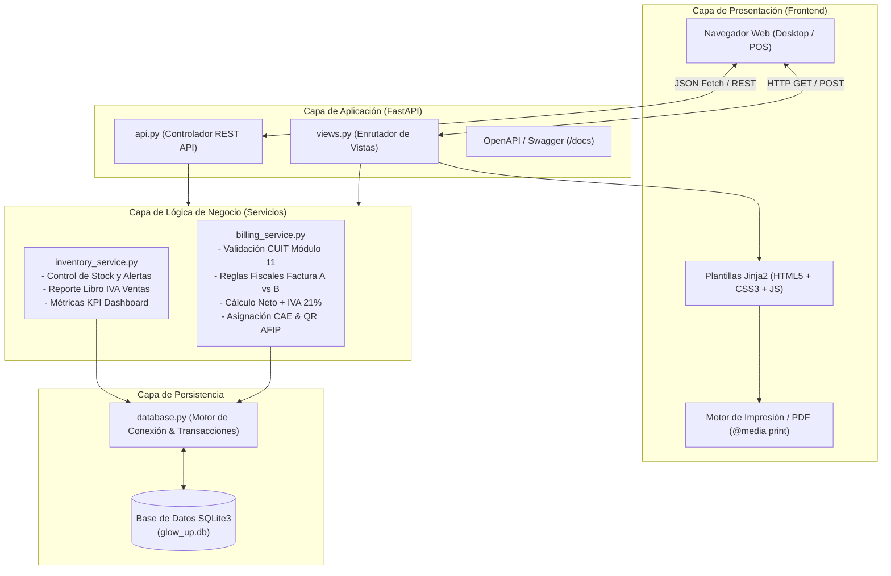
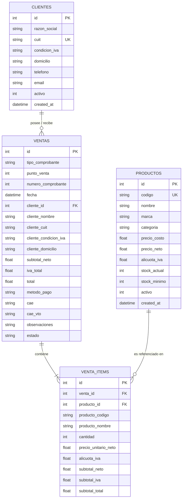

# 📄 TRABAJO PRÁCTICO INTEGRADOR: SOFTWARE DE GESTIÓN COMERCIAL
## SISTEMA DE FACTURACIÓN ELECTRÓNICA & CONTROL DE STOCK
### Caso de Estudio: "Glow Up Cosméticos S.R.L."

---

## 📌 CARÁTULA DEL TRABAJO PRÁCTICO

- **Asignatura / Cátedra:** Sistemas de Información / Ingeniería de Software / Práctica Profesional
- **Proyecto:** Sistema Integral de Gestión Comercial, Inventario y Facturación "A"
- **Organización / Empresa Ficticia:** Glow Up Cosméticos S.R.L.
- **Régimen Tributario:** IVA Responsable Inscripto (CUIT: 30-71829347-9)
- **Versión del Entregable:** 1.0.0
- **Fecha:** Septiembre de 2026

---

## 1. INTRODUCCIÓN Y JUSTIFICACIÓN DEL PROYECTO

### 1.1. Contexto de Negocio
**Glow Up Cosméticos S.R.L.** es una empresa comercial dedicada a la venta mayorista y minorista de productos de belleza, cuidado facial (skincare), maquillaje, fragancias y accesorios. 

La organización atiende a dos grandes segmentos de clientes:
1. **Canal Mayorista / Distribuidores / Salones de Estética:** Clientes con personería jurídica o comerciantes individuales inscriptos en el Impuesto al Valor Agregado como **Responsables Inscriptos**. Este segmento requiere obligatoriamente comprobantes de tipo **Factura "A"** para discriminar el Impuesto al Valor Agregado (IVA) y computarlo como crédito fiscal.
2. **Canal Minorista / Consumidores Finales:** Personas particulares que adquieren productos en el local comercial o mostrador, a quienes les corresponde la emisión de **Factura "B"** (donde el IVA se encuentra contenido en el precio final sin discriminación).

### 1.2. Planteo de la Problemática
Muchas micro y pequeñas empresas gestionan sus ventas de manera manual o mediante hojas de cálculo, incurriendo en:
- Errores en la emisión de comprobantes (por ejemplo, emitir una Factura A a un consumidor final, lo cual viola la ley de procedimiento tributario).
- Errores de cálculo en las alícuotas impositivas (21% y 10.5%).
- Quiebres de stock no detectados a tiempo debido a la falta de sincronización entre la caja de ventas y el depósito.
- Dificultades para confeccionar a fin de mes el reporte fiscal obligatorio (**Libro IVA Ventas**).

### 1.3. Objetivos del Sistema
- **Objetivo General:** Diseñar, desarrollar e implementar un software de gestión comercial que centralice el inventario de cosméticos, agilice el proceso de cobranza y garantice el cumplimiento fiscal estricto en la emisión de **Facturas "A"**.
- **Objetivos Específicos:**
  1. Proveer un Punto de Venta (POS) intuitivo que calcule automáticamente los importes netos, el débito fiscal del IVA y los totales en tiempo real.
  2. Implementar un motor de reglas fiscales que valide el CUIT mediante el algoritmo oficial de **Módulo 11** e impida la emisión de comprobantes tipo "A" a receptores no habilitados.
  3. Emitir el comprobante oficial con diseño reglamentario de AFIP / ARCA (con recuadro central "A", código de comprobante "01", CAE, fecha de vencimiento y código QR).
  4. Mantener la consistencia del inventario mediante transacciones atómicas (ACID) que descuenten stock al vender y lo reintegren al anular.
  5. Generar reportes contables inmediatos (Libro IVA Ventas exportable).

---

## 2. MARCO TEÓRICO Y REGULATORIO IMPOSITIVO (AFIP / ARCA)

### 2.1. Régimen de Emisión de Factura "A"
De acuerdo con la Resolución General AFIP N° 1415 y modificatorias, la emisión de comprobantes clase "A" está estrictamente regulada:
- **Sujeto Emisor:** Debe ser obligatoriamente un contribuyente inscripto en el régimen general de IVA (**Responsable Inscripto**).
- **Sujeto Receptor:** Debe revestir el carácter de **IVA Responsable Inscripto** (o casos especiales de monotributistas habilitados por ley para cómputo de crédito fiscal).
- **Discriminación Obligatoria:** En la Factura A, el precio de venta unitario no contiene el impuesto. El impuesto debe exponerse en un campo explícito denominado *IVA Débito Fiscal*, calculado sobre el *Subtotal Neto Gravado*.

### 2.2. Matemática Impositiva Aplicada
Para cada artículo $i$ de la venta:
$$\text{Neto}_i = \text{Precio Unitario Neto}_i \times \text{Cantidad}_i$$
$$\text{IVA}_i = \text{Neto}_i \times \left( \frac{\text{Alícuota}_i}{100} \right)$$
$$\text{Subtotal}_i = \text{Neto}_i + \text{IVA}_i$$

Para el comprobante total:
$$\text{Subtotal Neto Gravado} = \sum_{i=1}^{n} \text{Neto}_i$$
$$\text{Total IVA 21\%} = \sum_{i=1}^{n} \text{IVA}_i$$
$$\text{Importe Total Facturado} = \text{Subtotal Neto Gravado} + \text{Total IVA}$$

### 2.3. Algoritmo de Verificación de CUIT (Módulo 11)
El CUIT (Clave Única de Identificación Tributaria) se compone de 11 dígitos:
$$\text{CUIT} = [d_1, d_2, \dots, d_{10}, d_{11}]$$
Donde $d_1 d_2$ es el prefijo (ej: 30 para empresas, 20/27 para personas físicas), $d_3 \dots d_{10}$ es el número correlativo o DNI, y $d_{11}$ es el **dígito verificador**.

El cálculo ponderado se realiza con la secuencia de coeficientes $[5, 4, 3, 2, 7, 6, 5, 4, 3, 2]$:
$$\text{Suma} = \sum_{j=1}^{10} (d_j \times c_j)$$
$$\text{Resto} = \text{Suma} \pmod{11}$$
$$\text{Dígito Verificador Esperado} = \begin{cases} 0 & \text{si } \text{Resto} = 0 \\ 9 & \text{si } \text{Resto} = 1 \text{ (casos especiales)} \\ 11 - \text{Resto} & \text{en cualquier otro caso} \end{cases}$$

---

## 3. ESPECIFICACIÓN DE REQUISITOS DEL SOFTWARE

### 3.1. Requisitos Funcionales (RF)
- **RF-01 (Gestión de Productos):** El sistema debe permitir el alta, baja lógica, consulta y modificación de productos cosméticos, indicando SKU, descripción, marca, categoría, costo, precio neto, alícuota de IVA y stock.
- **RF-02 (Alertas de Stock Crítico):** El sistema debe alertar visualmente cuando las existencias de un producto sean menores o iguales a su stock mínimo fijado.
- **RF-03 (Padrón de Clientes):** El sistema debe almacenar los clientes con su Razón Social, CUIT, Domicilio Fiscal y Condición frente al IVA.
- **RF-04 (Validación de CUIT en Tiempo Real):** El sistema debe verificar la validez matemática del CUIT antes de permitir el alta de un cliente Responsable Inscripto.
- **RF-05 (Punto de Venta / Carrito):** El POS debe permitir seleccionar clientes, buscar artículos por nombre o SKU, regular cantidades y liquidar el comprobante.
- **RF-06 (Control de Emisión Factura A):** El sistema debe impedir la emisión de Factura A si el cliente seleccionado es Consumidor Final o no tiene un CUIT válido registrado.
- **RF-07 (Generación de CAE y QR):** Al emitir una factura, el sistema debe asignar un número correlativo independiente para el punto de venta, generar el Código de Autorización Electrónico (CAE), su vencimiento y la URL estructurada para el código QR de AFIP.
- **RF-08 (Descuento y Reintegro de Stock):** Cada venta debe decrementar las unidades de inventario de forma inmediata. La anulación de una factura debe restituir las unidades al stock.
- **RF-09 (Comprobante Reglamentario Imprimible):** El sistema debe renderizar la factura con el formato visual de la AFIP (cabecera dividida con letra A en el recuadro central, código 01, desglose de IVA y totales), optimizado para impresión o guardado en PDF.
- **RF-10 (Libro IVA Ventas):** El sistema debe listar cronológicamente todos los comprobantes emitidos en el período y permitir la exportación a formato CSV.

### 3.2. Requisitos No Funcionales (RNF)
- **RNF-01 (Rendimiento):** Tiempos de respuesta menores a 200 ms en consultas y emisión de facturas locales.
- **RNF-02 (Integridad Transaccional):** Empleo de transacciones ACID en la base de datos SQLite para evitar discrepancias entre la venta y el stock.
- **RNF-03 (Usabilidad):** Interfaz web limpia, adaptada a la estética de cosmética, responsiva para pantallas de terminal de caja o computadoras de escritorio.
- **RNF-04 (Mantenibilidad):** Separación estricta en capas (Enrutadores, Servicios de Negocio, Modelos y Persistencia).
- **RNF-05 (Compatibilidad):** Capacidad de ejecutarse en sistemas operativos estándar (Windows, Linux, macOS) con solo tener instalado Python.

---

## 4. ARQUITECTURA DEL SISTEMA Y TECNOLOGÍAS

El sistema adopta una arquitectura en capas desacopladas con el patrón MVC (Modelo - Vista - Controlador):



---

## 5. MODELO DE DATOS RELACIONAL

### 5.1. Diagrama Entidad-Relación (Mermaid)



### 5.2. Diccionario de Datos Sintético
1. **`clientes`**: Almacena clientes mayoristas y minoristas. La columna `condicion_iva` (`IVA Responsable Inscripto`, `Monotributo`, `Consumidor Final`) es el pilar para determinar la elegibilidad de Factura A.
2. **`productos`**: Almacena el inventario de cosméticos. El precio base es `precio_neto` (sin IVA), lo cual facilita el cálculo transparente de la Factura A.
3. **`ventas`**: Encabezado del comprobante fiscal. Almacena la numeración correlativa por punto de venta, totales discriminados, CAE y vencimiento.
4. **`venta_items`**: Detalle o renglones de la factura con el cálculo individual de Neto e IVA por línea.

---

## 6. PLAN Y REGISTRO DE PRUEBAS DEL SISTEMA

Se ejecutaron pruebas unitarias y de integración automáticas documentadas en `tests/test_core.py`:

| Código | Caso de Prueba | Entrada de Datos | Resultado Esperado | Resultado Obtenido | Estado |
| :--- | :--- | :--- | :--- | :--- | :---: |
| **CP-01** | Validación Algoritmo Módulo 11 (CUIT Válido) | CUIT: `30-71829347-9` y `30-65489123-7` | Función retorna `True` | Función retorna `True` | **PASÓ** ✅ |
| **CP-02** | Validación Algoritmo Módulo 11 (Dígito Erróneo) | CUIT: `30-71829347-2` | Función retorna `False` | Función retorna `False` | **PASÓ** ✅ |
| **CP-03** | Rechazo Fiscal de Factura A a Consumidor Final | Cliente con condición `Consumidor Final` intentando emitir Factura A | Lanzar `BillingException` con mensaje explicativo de incompatibilidad AFIP | Bloqueo fiscal exacto con mensaje de error | **PASÓ** ✅ |
| **CP-04** | Emisión y Desglose de Factura A | Cliente Responsable Inscripto (`30-65489123-7`), 2 Serums ($8.500 c/u neto) | Neto: $17.000,00; IVA 21%: $3.570,00; Total: $20.570,00. Asignación de CAE y descuento de 2 u. de stock | Cálculos exactos al centavo, CAE de 14 dígitos y stock actualizado | **PASÓ** ✅ |
| **CP-05** | Anulación de Comprobante y Reintegro de Stock | Factura previa ID #3 | Estado cambia a `ANULADA` y se devuelven 2 u. al stock del producto | Stock restituido al nivel original y venta anulada | **PASÓ** ✅ |

---

## 7. MANUAL DE USUARIO Y GUÍA DE OPERACIÓN

### 7.1. Inicio del Servidor
Abra una consola en el directorio del proyecto y ejecute:
```cmd
run.bat
```
El sistema iniciará automáticamente el servicio web en el puerto 8000.

### 7.2. Operación del Punto de Venta (POS)
1. Ingrese a `http://127.0.0.1:8000/pos`.
2. En la sección **Datos del Cliente**, elija el cliente destinatario.
   - Si selecciona un cliente **IVA Responsable Inscripto**, el sistema seleccionará automáticamente **Factura A** y mostrará la leyenda informativa del cómputo de crédito fiscal.
   - Si selecciona un **Consumidor Final**, el sistema activará **Factura B**. Si el usuario intenta forzar Factura A, el sistema mostrará un bloqueo con el fundamento fiscal correspondiente.
3. Haga click en los productos cosméticos del catálogo para sumarlos al pedido.
4. Ajuste cantidades usando los botones `+` y `-`.
5. Observe en tiempo real el desglose:
   - **Subtotal Neto Gravado**
   - **IVA Débito Fiscal (21%)**
   - **Total Facturado**
6. Seleccione el método de pago y presione **Emitir Factura A**.
7. En el cuadro de diálogo de confirmación, presione **"🖨️ Ver e Imprimir Factura A"** para visualizar el comprobante con formato oficial AFIP y mandarlo a imprimir o guardar como PDF.

### 7.3. Consulta de Reportes (Libro IVA Ventas)
Diríjase a `http://127.0.0.1:8000/libro-iva` para consultar el total acumulado de operaciones del mes, verificar el débito fiscal liquidado y hacer click en **Exportar a CSV** para abrirlo en Excel.

---

## 8. CONCLUSIONES

El desarrollo del presente Trabajo Práctico demostró la importancia de alinear los requisitos de software con la realidad tributaria y comercial del país. 
- Se logró un sistema ágil, modular y libre de dependencias complejas, que implementa con rigor el cálculo del Impuesto al Valor Agregado y las reglas de emisión de la **Factura "A"**.
- El código se encuentra estructurado bajo buenas prácticas de ingeniería de software (separación de capas, validación rigurosa de entradas mediante Pydantic y pruebas automatizadas).
- La solución ofrece una base sólida y extensible para futuras integraciones, tales como la conexión directa con los Web Services SOAP de AFIP (WSFE) o la incorporación de módulos de compras a proveedores.
